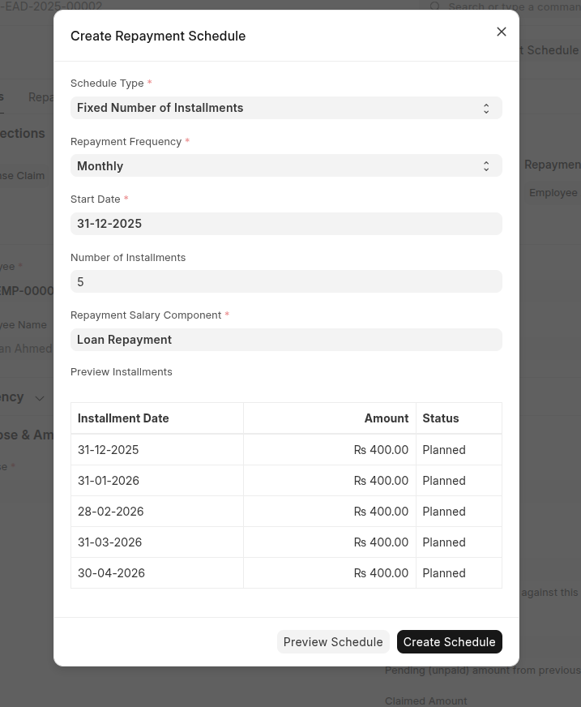
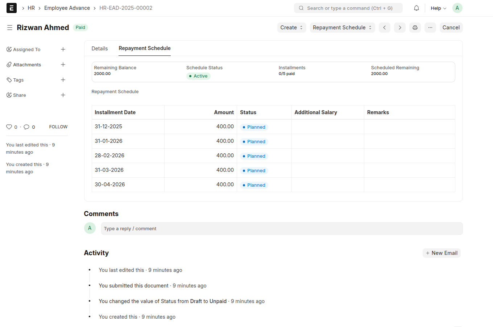

### Employee Advance Enhanced

Enhancement to Frappe HRMS Employee Advance. That makes return on employee advance easier.

### Installation

You can install this app using the [bench](https://github.com/frappe/bench) CLI:

```bash
cd $PATH_TO_YOUR_BENCH
bench get-app $URL_OF_THIS_REPO --branch develop
bench install-app eae
```

### Features

1. Schedule Autotamtic Employee Advance Repayment Fully Integrated with Frappe HRMS Payroll Module.


2. View Pending Instalment in Dashboard.


### User Guide.
Please Refer to [User Guide](docs/user_guide.md)

### License

mit
